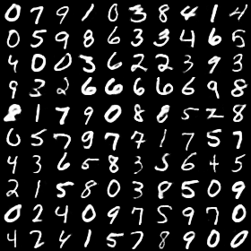

This repo reimplements the MNIST auto encoder experiment in Hinton's 2006 paper: Reducing the Dimensionality of Data with Neural Networks.

To start, run 

`uv run main.py`

By far, I've establishd a baseline on MNIST with 3.36 average square loss, compared to 3.00 reported in the paper. A visualization of some reconstructed test set data can be found below and they look pretty much the same to the original data.

**Original:**

**Reconstructed:**

Almost 20 years have passed and it only takes me collectively an hour or so to implement this experiment. On a RTX 3060, the whole training takes only a little more than one minute. I can avoid worrying about the Boltzman Machine algorithm, and the training succeeds with the help of better initialization, better optimizer, batch norm, gradient clipping, and learning rate scheduler etc.